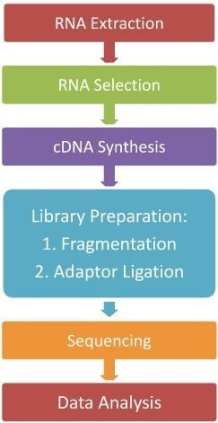
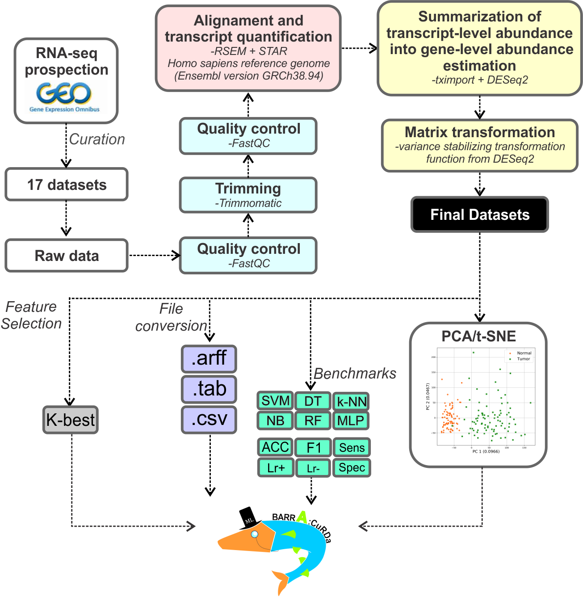
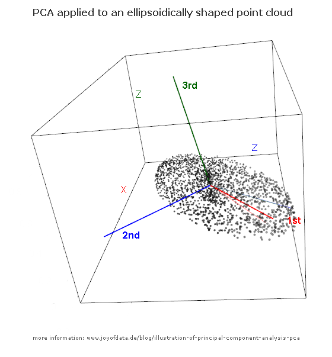

<style>
#header .btn-group {
    display: none;
}
</style>

<!-- TO DO: GIVE MORE EXPLANATIONS ABOUT WORKING DIRECTORY -->
<!-- TO DO: RENAME EXERCISES BY A, B, C, ... -->

<!-- ###################################################################### -->
<!-- ###################################################################### -->
# Intro and Overview
<!-- ###################################################################### -->
<!-- ###################################################################### -->

<!-- ###################################################################### -->
## Pre-requisites
<!-- ###################################################################### -->

### R and RStudio
<div style="text-align: justify;">
Make sure that **R** and **RStudio** are installed in your computer. You can create a new **R Script** in **RStudio** to copy example source code from this tutorial and write code for the exercises. Save the script in your home directory (or a sub directory of your choice). To run the code written on the current line (or of selected lines), click on button **Run** or press **CTRL+ENTER**. Results will be displayed either in the **RStudio**'s console or the Viewer panel (graphics). To read the documentation about a function (Help panel), in the script, place the cursor on the function's name and press F1. 

### package installation
The packages we'll need can be installed with the following code: <br>
Note the comment lines, which can be used in R code to tell the interpreter to not read the text as code. They will will tell you a bit more about what you are installing! :)

```{r}
# tidyverse, a versatile and large collection of packages to manipulate data in R
# It provides read and write functions, a more modern dataframe object called tibble
# and the pipe operator %>% allowing you to chain functions together.
# it also contains ggplot2, which we'll use for data visualization.
install.packages("tidyverse")
# BioConductor is a package that allows you to install packages from the
# project/repository of the same name, see more in chapter 1.3
if (!require("BiocManager", quietly = TRUE))
    install.packages("BiocManager")
BiocManager::install(version = "3.18")
# Software we'll need for downstream analysis.
BiocManager::install(c(
  "DESeq2",
  "limma", 
  "edgeR",
  "EnhancedVolcano",
  "ComplexHeatmap",
  "fgsea"
))
```


<div>

<!-- ###################################################################### -->
## Introduction
<!-- ###################################################################### -->
<div style="text-align: justify;">
Becaue of the ever-growing number of publicly available and large datasets in life sciences, computational and statistical skills are becoming a key part of the life scientist's curriculum. This tutorial aims to give you an overview on how to load and convert data in R and how to do exploratory analysis, prior to delving deeper into downstream analysis of differential expression and gene set enrichments.

This tutorial uses the backbone of Dr. Jean-Fred Fontaine's R data analysis tutorial, taught in out other modules.

<div> 

While microarrays are still in use and can be especially useful when interested in a specific set of genes (Custom Arrays), RNA-seq is the main sourch for expression data nowadays. Nevertheless, many techniques, use for RNA-seq count data, in this course are directly - or with minor changes - applicabkle to microarray data too. 

The basic workflow for RNA-seq and computational analysis can be seen in the figures below: 

<div style="display: flex;">
<div style="flex: 80%;">
![Rouch scheme of a wet-lab workflow for RNA-seq. RNA is isolated from the source, fragmented and subsequently converted with the help of reverse transcriptse to CDNA. From here standard massively parallel sequencing techniques can be used: Adapters are added to the DNA strands, which are used internally in the sequencer and can differ dependeing on the sequencing chemistry used. The resszult, will be provided in form of a FASTQ file, that contains millions of short sequences, termed "fragments "or "reads". \nThe color code, shows to which steps the illustration on the right roughly belong. Note that RNA-extraction and selection are critical points in the process, that can alter the results significantly, by changeing the input amounts and kind of RNA. <br> Adapted from: https://microbenotes.com/rna-sequencing-principle-steps-types-uses/ by Johannes Wolter](images/rna-seq-lab.jpg)
</div> 

<div style="flex: 20%;">

</div>
</div>

![Quality control ensures, that the wet-lab experiments, worked as intended and can give the analyist insights on how to handle the data. If there are problematic samples, they can be removed to stop them from biasing the results, certain types of artifacts, namnely batch effects, can also sometimes be detected during this phase and taken into account downstream. The subsequent mapping step holds much information about the quality of the data and should be considered if compute is not too demanding. <br>Trimming can be used to increase the coverage of reads on the reference genome and to filter out faulty reads, increasing the overall quality and useability of a sample. For RNA-seq it is often not as important as for other functional genmoics assays, though. <br>The mapping step is one of the most important in the pipeline. The reads saved in the FASTQ file are mapped, or aligned, to a reference genome. That means, an algorithm searches the whole genome for the best fit of the sequenc of the given read. This step is computationally demanding as millions of reads need to be aligned to a sequence of millions of nucleotides. The resulting BAM files can be annotated and the reads that fall on the locus of a gene be counted, resulting in a gene count matrix. We will use such a matrix, for which the preprocessing was already done in this course. <br>Source: https://biocorecrg.github.io/RNAseq_course_2019/alignment.html ](images/expression-analysis-pipelines.png)

<br>

<div style="border: 1px solid black; padding: 10px; background-color: #f9f9f9;">
<p style="text-align: center; font-weight: bold;">Automated Quality Control with ML</p>
If you are interested in the quality control of FASTQ files, inRNA-seq as well as other functional genmoics data, have a look at our work predicting sample quality with machine learning: <br>
Quality prediction: <br> https://genomebiology.biomedcentral.com/articles/10.1186/s13059-021-02294-2 <br>
Batch effect detection with the same software: <br> https://bmcbioinformatics.biomedcentral.com/articles/10.1186/s12859-022-04775-y
</div>

<!-- ###################################################################### -->
## Overview
<!-- ###################################################################### -->
<div style="text-align: justify;">

The R language comes with many functions already working, such as arithmetic and logical operators, built-in functions like **dim(), str(), min(), max(), mean()** and much more. As a programming language it also features control structures like loops and allows you to write your own functions. 
It is an object-oriented languae that allows, which allows to pack information from multiple sources into one object, which is often utilized as such by the bioinformatics packages and which we will also encounter. <br


### RLang, packages and Libraries

The base language of R was meant for statistical programming and data visualization, but has been expanded by its community with packages for multiple scietific and programmatic purposes. Especially, for data science, machine learning and bioinformatics. Most packages that handle bioinformatics are available through BioConductor a project dedicated to building and maintaining bioinformatic software: 
<blockquote style="color: #336699; font-family: Arial, sans-serif; font-style: italic; font-size: 18px;">
The mission of the Bioconductor project is to develop, support, and disseminate free open source software that facilitates rigorous and reproducible analysis of data from current and emerging biological assays. We are dedicated to building a diverse, collaborative, and welcoming community of developers and data scientists.
</blockquote>
<br> 
To use the packages mentioned above, we'll install them first. You should have tried it already in the prerequisites section. 
If it worked out, we can load the packages - or *libraries* - by calling the **library()** functioon: 
```{r, message=FALSE, warning=FALSE, echo=TRUE, results='hide'}
library(tidyverse)
library(DESeq2) # differential anlysis
library(stats) # standard R pkg for statistics, we'll use its PCA implementation

```

<!-- ###################################################################### -->
<!-- ###################################################################### -->
# Import and data objects
<!-- ###################################################################### -->
<!-- ###################################################################### -->


<!-- ###################################################################### -->
## The Dataset
<!-- ###################################################################### -->
Top run any analysis, we first need our data of course. 
We'll get our data from an already prepossessed and curated dataset source called BARRA:CuRDa - weird name I know - but we'll not take the complete set but only choose some sets. The database, with it's downloadable datasets and the paper can be found here: https://sbcb.inf.ufrgs.br/barracurda.
The authors of the database and paper, have used the following workflow, you'll notice some overlaps with what was discussed in the **Introduction**. <br>

<br>
The dataset was picked and curated to be optimal for machine learning and benchmarked for mutliple algortihms. We'll explore some of that in the second week of the course and compare our differential genes with what the ML algos deem as important in our data. First, we'll focus on exploratory and differential analysis though. 
<br> 
We'll start out with the Head and Neck Cancer datasets **GSEGSE64912** and **GSEGSE68799**.


<!-- ###################################################################### -->
## Importing data into R
<!-- ###################################################################### -->
To demarcate the content of each cell in a file, people use special characters like commas, tabs, pipes, etc. The extension of plain-text files is often a good hint of what delimiter has been used. For example, csv files should use “commas” as the delimiter, whereas tsv files should use “tabs”. Nevertheless, you can find csv or tsv files that are delimited with different characters. 

The first step in data import is locating the file in your computer or in a remote location (e.g. by URL). The most important parameter for readr’s functions is the path to the file of interest.

In this part, you are going to import files located on your machine that you either downloaded from the link above or froim your course files. The **tidyverse** library must be loaded.

### Where are we???
Before actually importing the data: <br>
We need to check where our current **working directory** is and if our files are in a relative path or not. 
If it is not the case we can either choose to include their whole path or set up our working directory in such a way, that we can work from the dedicated folder for the project and have our data and output in the same directory as subdirs. <br> 
When we set up our working directory, we can download the data files and deposit them in the data/input folder.
<span style="color: #336699; font-weight: bold;">Note: the path "C:/Some/random/path/" is an example, you'll not be able to just execute the code below :)</span>
```{r}
# returns the current working dir
getwd()

# sets the current working dir to its input
setwd()
# needs input, otherwise throws an error! :)

# file.path() is a helper function, that glues toigether multiple input strings to a file path. 
# to set a completely new path:
# either
setwd(file.path("C:", "Some", "random", "path"))
# or 
setwd("C:/SOme/random/path")

# set a path relative to the current working dir
setwd(file.path(getwd(), "Some", "downstream", "path"))
```
<br> 

### Excersise 1. 
To set up your working dir, you can either work in your respective OS and create a folder called "Bioinfo-module" and set this as the wording dir with the *setwd()* function. 
```{r}
path_dir <- "C:/Some/random/path/bioinfo-module"
 
setwd()
```
Or you can create it from RStudio directly, with the *dir.create()* function.
```{r}
dir.create("bioinfo-module")
setwd(file.path(getwd(), "bioinfo-module"))
```

Now we can set up our input and output directories, which we'll use to have a bit of structure in our working directory.
```{r}
# assign variables to names of out folders (these could also be whole paths, pointing somewhere else entirely!)
out.dir <- "output"
in.dir <- "data"

# create the dirs
dir.create(out.dir)
dir.create(in.dir)
```
<span style="color: #336699; font-weight: bold;">Now you need to deposit the data in the dedicated folder. <br>Note that these files are zipped and need to be unzipped in their destination folder (smaller files can be read in zipped, however files of these size take their time and I don't want to risk it on the NatFak machines :D).</span>

### Importing a csv file
First, we'll import a single file
```{r message=FALSE, warning=FALSE}
test <- read_csv(file.path(in.dir, "GSE68799.csv"))
test
```

Well that worked out well! Note how simple the syntax for data import is: you choose the name of a variable to store your table, use the **<-** operator (written with 2 characters: **<** and **-**), call the appropriate **readr** function and specify the location of your file.
<br>So now we'll get all files in the input folder and read in each of them.
<br> additionally, we'll save the names of the respective files, so that we can keep that info for later. 
```{r, echo=TRUE, results='hide'}
# get the file names, note that this will only return the names of the file not the whole paths
# (whioch we coould do though! Check out the functions vignette, by pressing F1, when the curser is on its text.)
csv_files <- list.files(path = file.path(in.dir), pattern = "\\.csv$")

# now we could write a for loop, to iterate over the list and get each file.
# We'd need to declare a list-object before that has the right size and
# than could put each table into the given list.
# However, loops are not very efficient (especially in R).
# the todyverse has a solution for us: 
# the purrr package provides the map() function which allows us to vectorize operations.

data_list <- map(file.path(in.dir, csv_files), read_csv)
# assign names to list
names(data_list) <- str_remove_all(csv_files, ".csv") 
# loop over list and add a column containin the dataset name!
# we'll again use the a function instead ov writing a loop :)
# this time it's imap(), which also passes the name of a given element not only its contents.
data_list <- imap(data_list, ~ .x %>% mutate(dataset=.y))

# now we can put them together!

combined_data <- bind_rows(data_list)

```


### Exercise 1.2 <br>Inspect your data
Now that we have our data at hand, we'll need to observe it. 
Use the **head()**, **str()** and **dim()** functions to get an overview of the data. 
Does anything strike you as unexpected?
try to also inspect other objects with the **str()** and **summary** function: What kind of object are the paths to you in- and output-folders? What classes of other objects have we assigned toi variables until now? 
```{r}
# str(combined_data)

dim(combined_data)

head(combined_data)

```
What we have at our hands was formated to be used with ML tools: <br>
It shows the variables (features) in the columns and the Observations (samples) in the rows (<span style="color: #336699; font-weight: bold;">samples x features</span>). 
This data format is particularly useful for plotting and most machine learning software, will also expect this format. 
However, in most other applications in R, like statistical functions and also the bioinformtic packages we'll be using, the oposite is expected: 
<span style="color: #336699; font-weight: bold;">features x samples</span>


### Exercise 1.3 <br>Transpose and build a metadata table metadata

a. Assign a new variable called *meta.data* that hold the general information about the samples. The meta.data should be a dataframe or matrix, not a tibble and it should have the ID assigned as **row.names()**. 
b. Assign a new variable called *counts* that hold the numerical information about the samples. It should be Genenames x sample names, the genenames should be assigned as row names. 

Use the **select()** function for both tasks. 
<br>Tipp: you can *deselect* a column, by using **-** infront of the column name.
<br>Tipp: Use **as.data.frame()/as.matrix()** and **column_to_rownames()** to accomplish this. 
<br>Feel free to use the pipeoperator **%>%** to select the data. 

```{r,echo=TRUE, results='hide'}
# build metadata
meta.data <- combined_data %>% 
  select(ID, class, dataset) %>% 
  column_to_rownames("ID") %>% 
  as.matrix()
meta.data

# make count matrix
counts <- combined_data %>%
  select(-class, -dataset) %>% 
  column_to_rownames("ID") %>% 
  t()
counts

```

Now that we have transposed our data, we can use the **summary()** function, to get an overview at how the counts are distributed over each sample. 
```{r}
summary(counts)
``` 

<!-- ###################################################################### -->
<!-- ###################################################################### -->
# Exploratory Analysis
<!-- ###################################################################### -->
<!-- ###################################################################### -->


<!-- ###################################################################### -->
## Foreword
<!-- ###################################################################### -->

Exploratory analysis is a critical first step in the interpretation of RNA-seq data, and when working with similar data organized in abundance/count/intensity matrices. This process is akin to an initial survey of the data landscape, aimed at understanding its basic characteristics, identifying potential outliers, and uncovering early patterns or trends. It can also include checking for batch effects, which are technical variations that can introduce unwanted noise into the data. In this respect it can also be used as the "last line" of quality control. 

Visualization tools, such as heatmaps, box plots, and scatter plots, are commonly used in this stage to provide a graphical summary of the data. These can help researchers gain insights into the expression levels of different genes, the similarity between samples, and the overall structure of the data.

In summary, exploratory analysis of RNA-seq count data serves as a foundational step in the data analysis pipeline, setting the stage for more complex downstream analyses, such as differential expression analysis and pathway enrichment analysis. It helps ensure that the data is of high quality and that any subsequent conclusions drawn from the data are reliable and robust.


<!-- ###################################################################### -->
## Principal Component Analysis and Scatter plots. 

We'll first get an overview of the data by plotting the first two components of a PCA. 
This will give us an overview of how similar the samples are to each other and if we have any batch effects to expect from the differing datasets. 

### What's a PCA though?
A Principal Component Analysis, short PCA, is a (linear) *dimension reduction* technique and therefore can be counted to classical unsupervised machine learning. 
It's been around since 1901 and basically computes linear combinations that represent the variance in the data best. To do that it starts, with the longest axis in the data, by minmizing the distance of each point in the data to the first linear combination it computes: The first principal component (PC). This GIF gives a good intuition whats happening under the hood: <br>

The process is repeated incrementally, but every following PC must be orthogonal to all its predecessors, to ensure the PCs do not overlap in information about the underlying variance of the data. The image below shows three PCs fitted to an ellipsoid. 


The thread I found these images is from crossvalidated, a sub-site of stackexchange, where one can often find answers to questions regarding statistics and machine learning. I reciommend to check out the thread, it has a number of answers, rwanging from very mathematical to much mnore intuitive explanations (as hopefully given above :D)
<br> Link: https://stats.stackexchange.com/questions/2691/making-sense-of-principal-component-analysis-eigenvectors-eigenvalues


### And a scatterplot? 
A scatterplot is the most simple plot you can come up with, it plots two numerical variables against each other leading to a point cloud. We'll plot the fiirst two principal components against each other. 


<!-- ###################################################################### -->
There are three simple and interrelated rules that make a dataset tidy:

1. Each **observation/sample** must be reported in its own **row**
1. Each **variable/feature** describing the sample must have its own **column**
1. Each **value** must have its own **cell**

We will import some tables and check if they fulfill the above rules.

### Exercise 3.1
Import file `http://cbdm-01.zdv.uni-mainz.de/~jfontain/files/r_tuto_ggplot/who1.csv` into variable **who1** and show the imported data. Is the who1 dataset tidy?

```{r message=FALSE, warning=FALSE, include=FALSE}
# Exercise 3.1 - SOLUTION
who1 <- read_csv("http://cbdm-01.zdv.uni-mainz.de/~jfontain/files/r_tuto_ggplot/who1.csv")
who1
# who1 is not tidy because variables are gathered
```


### Exercise 3.2
Import file `http://cbdm-01.zdv.uni-mainz.de/~jfontain/files/r_tuto_ggplot/who2.txt` into variable **who2** and show the imported data. Is the **who2** dataset tidy?

```{r message=FALSE, warning=FALSE, include=FALSE}
# Exercise 3.1 - SOLUTION
who2 <- read_delim("http://cbdm-01.zdv.uni-mainz.de/~jfontain/files/r_tuto_ggplot/who2.txt", delim="-")
who2
# who2 is not tidy because values are not separated
```


### Exercise 3.3
Import sheet population from file **datasets/who_split.xlsx** into variable **who_pop** and show the imported data. Is **who_pop** tidy?

```{r include=FALSE}
# Exercise 3.1 - SOLUTION
who_pop <- read_excel("datasets/who_split.xlsx")
who_pop
# not tidy because a variable is spread in columns
```


### Why tidy data?
Why ensure that your data is tidy? There are two main advantages:

1. If you have a consistent data structure, it’s easier to learn the tools that work with it because they have an underlying uniformity. The functions in the tidyverse all work flawlessly with tidy datasets.
1. Placing variables in columns allows R’s vectorised nature to shine.

The principles of tidy data seem very obvious. Unfortunately, most data that you will encounter will be untidy. There are two main reasons:

1. Most people aren’t familiar with the principles of tidy data.
1. Data is often organized to facilitate some use other than analysis.

This means that for most real analyzes, you will need to tidy your data.


<!-- ###################################################################### -->
## Spreading and gathering
<!-- ###################################################################### -->
When you are in front of a dataset, the first step is always to understand what the observations and the features that describe them are. The second step is to solve one of two common problems:

1. **One observation** is scattered across **multiple rows**
1. **One feature** is spread across **multiple columns**

To fix these problems, the **tidyverse** provides you with functions **spread** and **gather**.


### Spreading
You use function **spread** for Problem 1: one observation is scattered across multiple rows. That’s exactly the problem we saw in table **who1**:

```{r}
who1
```

**who1** is an excerpt of the World Health Organization Tuberculosis Report. Each observation, a country in a year in this case, should be accompanied by that year’s number of tuberculosis cases and population. However, each country-year pair appears twice in who1: one for the tuberculosis cases and one for the country’s population.

To tidy up this dataset, we need to spread column count into new columns, one for each of the keys specified in column type:


We can do this with function **spread** as follows:

```{r}
who1_tidy <- who1 %>% 
   spread(value = count, key = type)
who1_tidy
```

Note the syntax used to tidy up **who1**:

1. Choose a variable name to store the tidy data (this could very well be **who1** again).
1. Use the assignment operator **<-**.
1. Specify the variable that we want to tidy up.
1. Use the pipe operator **%>%** to channel the content of who1 to the function **spread** (more on the pipe operator later in this Part).
1. Call function **spread** and specify the column containing the **values** that we want to spread and the column containing the new variable names (known as the **key** column).


### Gathering
You use function **gather** for Problem 2: **one feature** is spread across **multiple columns**. That is exactly the problem we saw in, for example, table *who_cases* from the Excel file *who_split.xlsx*:

```{r}
who_cases
```


The column names 1999 and 2000 are actually values of the variable year, which means that each row represents two observations instead of one.

To tidy this dataset, we need to gather columns 1999 and 2000 into a new pair of variables:


We can do this with function **gather** as follows:
```{r}
who_cases_tidy <- who_cases %>% 
   gather(`1999`, `2000`, key = "year", value = "cases")
who_cases_tidy
```


Note the syntax used to tidy up *who_cases*:

1. Choose a variable name to store the tidy data (this could very well be *who_cases* again).
1. Use the assignment operator **<-**.
1. Specify the variable that we want to tidy up.
1. Use the pipe operator **%>%** to channel the contents of *who_cases* to function **gather**.
1. Call function **gather** and specify the columns we want to merge, the name of the column that will contain the merged **keys** and the name of the column that will contain the **value** for the number of tuberculosis cases per country.


### Exercise 3.4
Consider the following tibble, which records heights and weights of 3 students:

```{r}
students <- tibble(name = rep(c("Jonas", "Ines", "Hanna"), each = 2),
                   type = rep(c("height", "weight"), 3),
                   measure = c(1.83, 81, 1.75, 71, 1.69, 55))
students
```

Use the appropriate **tidyr** function on variable **students** to make it tidy.

```{r message=FALSE, warning=FALSE, include=FALSE}
# Exercise 3.4 - SOLUTION
# We need to spread type and measure
students_tidy <- students %>% spread(value = measure, key = type)
students_tidy
```


### Exercise 3.5
Consider the following tibble, which records the expression of 4 genes at 3 different time points (d00, d02 and d04):

```{r}
genes <- tibble(symbol = c("DMD", "MYOG", "MYF5", "MYOD1"),
                d00 = c(0.697, 0.844, 1.878, 1.622),
                d02 = c(1.986, 0.051, 0.887, 1.313),
                d04 = c(0.157, 0.774, 1.507, 0.628))
genes
```

Here, an observation should be a gene at a given time point. Use the appropriate tidyr function on variable genes to make it tidy.

```{r message=FALSE, warning=FALSE, include=FALSE}
# Exercise 3.5 - SOLUTION
# We need to gather columns delimited in the table by d00 and d04
genes_tidy <- genes %>% gather(d00:d04, key="time", value="expression")
genes_tidy
```


<!-- ###################################################################### -->
## Separating and uniting
<!-- ###################################################################### -->

### Separating
When one column in a dataset contains two variables, we’ll need to use function **separate** to fix the issue. That’s exactly the problem we saw in table *who2*:

```{r}
who2
```

Column rate contains both cases and population, so we need to split it in two:


We can do this with function **separate** as follows:

```{r}
who2_tidy <- who2 %>% 
   separate(rate, into = c("cases", "population"), sep = "/")
who2_tidy
```

Note the syntax used to tidy up **who2**:

1. Choose a variable name to store the tidy data (this could very well be **who2** again).
1. Use the assignment operator **<-**.
1. Specify the variable that we want to tidy up.
1. Use the pipe operator **%>%** to channel the contents of **who2** to function **separate**.
1. Call function **separate** and specify the column we want to split, the name of the new columns and the separator that is currently merging the variables.


### Uniting
When a variable is stored in two separate columns and is more convenient to combine them, we need to use function **unite*. Table *who3* has this problem:

```{r message=FALSE, warning=FALSE}
who3 <- read_tsv("http://cbdm-01.zdv.uni-mainz.de/~jfontain/files/r_tuto_ggplot/who3.tsv")
who3
```


Column **century** and **year** can be combined into a single column called **year**:


We can do this with function **unite** as follows:

```{r}
who3_tidy <- who3 %>% 
   unite(century, year, col = "year", sep = "")
who3_tidy
```

Note the syntax used to tidy up who3:

1. Choose a variable name to store the tidy data (this could very well be **who3** again).
1. Use the assignment operator **<-**.
1. Specify the variable that we want to tidy up.
1. Use the pipe operator **%>%** to channel the contents of **who3** to function **unite**.
1. Call function **unite** and specify the columns we want to merge, the name of the new column and the separator that we want to use to merge the column values.


### Exercise 3.6
Consider the following tibble, which records heights and weights of 3 students:

```{r}
students <- tibble(name = c("Jonas", "Ines", "Hanna"),
                   ratio = c("81/1.83", "71/1.75", "55/1.69"))
students
```

Use the appropriate **tidyr** function on variable **students** to make it tidy.

```{r message=FALSE, warning=FALSE, include=FALSE}
# Exercise 3.6 - SOLUTION
# We need to separate ratio
students_tidy <- students %>% 
  separate(ratio, into=c("height", "weight"), sep = "/")
students_tidy
```


### Exercise 3.7
Consider the following tibble, which records the price of 4 drugs:

```{r}
drugs <- tibble(name = c("penicillin", "insuline", "aspirin", "lanoxin"),
                euros = c(13, 17, 5, 25),
                cents = c(81, 20, 14, 12))
drugs
```

Use the appropriate **tidyr** function on variable drugs to make it tidy.

```{r message=FALSE, warning=FALSE, include=FALSE}
# Exercise 3.7 - SOLUTION
# We need to unite euros and cents
drugs2<-drugs %>% unite(euros, cents, col = "price", sep= ".")
drugs2
```


<!-- ###################################################################### -->
## The %>% operator
<!-- ###################################################################### -->

As you know already, we channel the contents of a **tibble** to the different **tidyr** functions using the pipe operator: **%>%**.

Pipes are a powerful tool for clearly expressing the operation we want to perform on a variable. In addition, they can be used to apply a sequence of operations to a variable.

Table *who3*, for example, has two problems: **cases** and **population** are expressed as a **rate** and **year** is split in columns **century** and **year**:

```{r}
who3
```

So, we clearly need two steps to tidy up this dataset:

```{r}
who3_tidy <- who3 %>% 
   separate(rate, into = c("cases", "population"), sep = "/")

who3_tidy <- who3_tidy %>% 
   unite(century, year, col = "yyyy", sep = "")

who3_tidy
```

Thanks to the pipe, we can apply these two operations to *who3* in one go:

```{r}
who3_tidy <- who3 %>% 
  separate(rate, into = c("cases", "population"), sep = "/") %>% 
  unite(century, year, col = "yyyy", sep = "")
who3_tidy
```

Note that this process reads almost like natural language:

1. We channel (or pipe) the content of *who3* to function **separate**.
1. **separate** splits column rate into columns *cases* and *population* using “/” as separator.
1. The result of **separate** is piped to function **unite**.
1. **unite** combines columns *century* and *year* into column **yyyy** using nothing (empty string "") as separator.

Even though writing the above code on a single line of code is still valid, it is good practice to use **ENTER** (i.e. a new line) after every **%>%** for clarity.


<!-- ###################################################################### -->
<!-- ###################################################################### -->
# Data transformation
<!-- ###################################################################### -->
<!-- ###################################################################### -->


<!-- ###################################################################### -->
## Foreword
<!-- ###################################################################### -->
Once you have tidied your dataset of interest, you will often need to create some new variables or summaries, or to reorder the observations to make the data easier to work with.

This part will show you how to use the functions from package **dplyr** to transform your data and understand it better.


Throughout this part, you are going to use a tidied up excerpt from the World Health Organization Global Tuberculosis Report. We have been working with this dataset, so you should be familiar with it:

```{r message=FALSE, warning=FALSE}
who_ref <- read_tsv("http://cbdm-01.zdv.uni-mainz.de/~jfontain/files/r_tuto_ggplot/who_ref.tsv")
who_ref
```

The tibble reports the number of tuberculosis cases in 1999 and 2000 for three different countries, as well as their population.


<!-- ###################################################################### -->
## Sorting by column(s)
<!-- ###################################################################### -->
To sort observations by one or more columns, **dplyr** offers function **arrange**. This function takes a tibble and a column name to order by:

```{r}
who_ref %>% 
  arrange(year)
```

If you provide more columns, **arrange** will first sort by the first one, then the second one and so on. This process breaks ties in the values of the preceding columns:

```{r}
who_ref %>% 
  arrange(year, cases, population)
```

To sort in descending order, you have to use **desc**:

```{r}
who_ref %>% 
  arrange(desc(country), cases)
```


<!-- ###################################################################### -->
## Selecting columns
<!-- ###################################################################### -->
Function **select** allows you to focus on variables you are really interested in by removing unwanted columns:

```{r}
who_ref %>% 
  select(country, cases)
```

You can also use the **:** operator to select a group of columns:

```{r}
who_ref %>% 
  select(year:population)
```

If you put a minus sign before columns in **select**, it means that you want to discard such variables:

```{r}
who_ref %>% 
  select(-population)
```

This, in combination with the **:** operator is specially useful when your dataset has hundreds or even thousands of columns and you want to focus only on a few:

```{r}
who_ref %>% 
  select(-(year:population))
```


<!-- ###################################################################### -->
## Renaming columns
<!-- ###################################################################### -->
If a column in your tibble has a strange or non-informative name, you can use function **rename** to solve this issue:

```{r}
who_ref %>% 
  rename(tuberculosis_cases = cases)
```


<!-- ###################################################################### -->
## Filtering rows
<!-- ###################################################################### -->
Function **filter** is one of the most useful tools in package **dplyr** as it allows you to subset observations based on their values. **filter** takes the contents of a tibble and its arguments are logical expressions to filter it.

For example, we can focus on tuberculosis cases in Brazil as follows:

```{r}
who_ref %>% 
  filter(country == "Brazil")
```

To retrieve Chinese cases that occurred after 1999, we do:

```{r}
who_ref %>% 
  filter(country == "China" & year > 1999)
```

To subset observations from Brazil or China:

```{r}
who_ref %>% 
  filter(country == "Brazil" | country == "China")
```

Note that we use the comparison operators >, <, >=, <=, ==, != (not equal) to specify the column value or range of values we want to focus on. In addition, we use the logical operators & (and) and | (or) to combine multiple conditions passed on to **filter**.

You can negate conditions with the **!** operator:

```{r}
who_ref %>% 
  filter(!(country == "Brazil"))
```

Basically, any operation that generates a logical vector can be used within **filter** to subset your tibble.


<!-- ###################################################################### -->
## Adding new variables
<!-- ###################################################################### -->
Besides selecting existing columns, it is often useful to create new ones that are functions of existing variables. **dplyr** offers function **mutate** to add new columns at the end of your dataset.

For example, it might be tempting to say that Afghanistan has better programmes against tuberculosis than Brazil and China. However, Afghanistan’s population is smaller. Let’s look at the number of cases per 10 thousand individuals to get a better picture:

```{r}
who_ref %>% 
  mutate(cases_per_10k = cases/(population/10000))
```

**mutate** can be used to create one or more variables at once:

```{r}
who_ref %>% 
  mutate(cases_per_10k = cases/(population/10000), thousand_cases = cases/1000)
```


<!-- ###################################################################### -->
## Grouped operations
<!-- ###################################################################### -->
It is often the case that some records in your dataset belong to certain groups. For example, we can group data in **who_ref** by country or by year:

```{r}
who_ref %>% 
  group_by(country)
```

```{r}
who_ref %>% 
  group_by(year)
```

Note that grouping by country results in 3 groups, whereas grouping by year results in 2.

It is also possible to group by multiple variables:

```{r}
who_ref %>% 
  group_by(country, year)
```

The result is 6 groups. This is not very useful in this particular example, because each observation belongs to its own group.

### Grouped summaries
If we pipe the result of a **group_by** operation to the function **summarise**, the unit of analysis changes from the complete tibble to each individual group. This is very useful, because we can compute useful statistics and summaries on a per group basis.

The following example computes the total number of tuberculosis cases per year:

```{r}
who_ref %>% 
  group_by(year) %>% 
  summarise(total_cases = sum(cases))
```

The following example computes the average number of cases per country and the corresponding standard deviation:

```{r}
who_ref %>% 
  group_by(country) %>% 
  summarise(avg_cases = mean(cases), st_dev = sd(cases))
```

Note how **summarise** collapses each group to a single row and drops columns not involved in the grouping process. In fact, if we use **summarise** without grouping first, it sees the entire tibble as a single group and the result is a single row:

```{r}
who_ref %>% 
  summarise(total_cases = sum(cases))
```

The above means that grouped summaries should be generated with functions that collapse their argument into a single value. Some useful summary functions are **sum, mean, median, sd, min, max and n**.

### Grouped mutates
If we pipe the result of a **group_by** operation to the function **mutate**, we can create new variables on a per group basis.

Say, for example, that we want to compute the fraction of tuberculosis cases in a year from the total occurred in a country over all the years:

```{r}
who_ref %>% 
  group_by(country) %>% 
  mutate(fraction = cases/sum(cases))
```

Note that grouped mutates do not collapse the input tibble. They maintain the original number of samples and columns. As a result, functions used to create new variables in **mutate** should produce the same number of members within the group.

### Grouped filters
If we pipe the result of a **group_by** operation to the function **filter**, we can remove observations (i.e. rows) on a per group basis.

For example, to find the year with the minimum number of tuberculosis cases in a country, we can do:

```{r}
who_ref %>% 
  group_by(country) %>% 
  filter(cases == min(cases))
```

As shown below, using **summarise** doesn’t work in this case because we lose the information about the year:

```{r}
who_ref %>%
  group_by(country) %>% 
  summarise(min_cases = min(cases))
```


<!-- ###################################################################### -->
## Case study
<!-- ###################################################################### -->
### Exercise 4.1

In this case study, you’re going to work with a dataset giving the monthly deaths from lung diseases in the UK between 1974 and 1979.

1. Import file `http://cbdm-01.zdv.uni-mainz.de/~jfontain/files/r_tuto_ggplot/uk_lung_deaths.csv` into variable **uk**.
1. Tidy up the dataset. The goal is to have a tibble with three columns: year, month and deaths.
1. Use **select** to re-accommodate the columns, such that they appear in the following order: month, year and deaths.
1. Data from 1974 is too old to be reliable, filter it out.
1. Use the **%>%** to perform points 1-4 in a single go and assign the result to variable uk.
1. Report the average number of deaths per month. Sort the result decreasingly by average deaths.
1. Report the average and total number of deaths per year. Sort the result by year.
1. For each month of a given year, calculate the percentage of deaths that the month represents in comparison to the total number of deaths in the given year. 
1. For each year, report the month with the maximum number of deaths. Sort the result by year.
1. Speculate about possible reasons why the months resulting from point 9 have the most deaths from lung diseases.


```{r message=FALSE, warning=FALSE, include=FALSE}
# Case Study - SOLUTION

# Step 1-5:
uk <- read_csv("http://cbdm-01.zdv.uni-mainz.de/~jfontain/files/r_tuto_ggplot/uk_lung_deaths.csv") %>%  # Step 1
  gather(Jan:Dec, key = month, value = death) %>%  # Step 2
  select(month, year, death) %>%                   # Step 3
  filter(year > 1974)                              # Step 4
uk

# Step 6:
uk %>% 
  group_by(month) %>% 
  summarise(avg_deaths = mean(death)) %>% 
  arrange(desc(avg_deaths))

# Step 7:
uk %>% 
  group_by(year) %>% 
  summarise(avg_deaths=mean(death), total_deaths=sum(death)) %>% 
  arrange(year)

# Step 8:
uk %>% 
  group_by(year) %>% 
  mutate(perc_per_month = death / sum(death) * 100)

# Step 9:
uk %>% 
  group_by(year) %>% 
  filter(death == max(death)) %>% 
  arrange(year)

# Step 10:
# lung diseases occur more often in winter months

```


<!-- ###################################################################### -->
<!-- ###################################################################### -->
# visualization and modeling
<!-- ###################################################################### -->
<!-- ###################################################################### -->


<!-- ###################################################################### -->
## Case study
<!-- ###################################################################### -->
The best way to show you the power of visualization for knowledge generation is by means of an example. In this part, you will use a dataset comprised of subjects who were part of a study aimed at understanding the prevalence of diabetes in central Virginia, USA. The variables describing the subjects are:

* **id**: A numeric ID for each subject.
* **ratio_ch**: Cholesterol/High Density Lipoprotein ratio.
* **stab.glu**: Stabilised glucose.
* **glyhb**: Glycosolated haemoglobin.
* **location**: County of origin.
* **age**: Age of the subject.
* **gender**: Gender of the subject.
* **ratio_wh**: Waist/Hip ratio.
* **body_measure**: Which body measurement was recorded.
* **measure**: Height or weight of the subject.

After tidying and transforming the “Diabetes Dataset”, you will visualize relationships between variables and feature distributions with functions from package ggvis in order to propose a simple model for susceptibility to diabetes.


You must load packages tidyverse and ggvis.

### Exercise 5.1
1. Import file `http://cbdm-01.zdv.uni-mainz.de/~jfontain/files/r_tuto_ggplot/diabetes.tsv` into variable diab.
1. Tidy up the imported tibble by piping a series of tidyr operations and assign the result to variable **diab**.
1. Get rid of column **id**.
1. Use **mutate** and **as.numeric** to transform character columns that should be numeric.
1. Height, waist and hip measurements are given in inches, convert them to centimetres (1 inch = 2.54 cm).
1. Weights are given in pounds, convert them to kilograms (1 pound = 0.454 kg).
1. Glycosolated haemoglobin levels above 7.0 are usually taken as a positive diagnosis of diabetes. Create a new column called **diagnosis** that takes the value “diabetic” when a subject’s level is greater than 7.0 and “healthy” otherwise (HINT: use function **ifelse**).

Result should look like the following table: 

```{r echo=FALSE, message=FALSE, warning=FALSE}
# Chapter 5 - Case study
# Exercise 5.1 - SOLUTION
diab <- read_tsv("http://cbdm-01.zdv.uni-mainz.de/~jfontain/files/r_tuto_ggplot/diabetes.tsv") %>% 
  spread(key = body_measure, value = measure) %>% 
  separate(ratio_ch, into = c("chol", "hdl"), sep = "/") %>% 
  separate(ratio_wh, into = c("waist", "hip"), sep = "/") %>% 
  mutate( chol  = as.numeric(chol),
          hdl   = as.numeric(hdl),
          waist = as.numeric(waist),
          hip   = as.numeric(hip),
          waist  = waist  * 2.54,
          hip    = hip    * 2.54,
          height = height * 2.54,
          weight = weight * 0.454,
          diagnosis = ifelse(glyhb>7, "diabetic", "healthy") 
        )
diab
```


<!-- ###################################################################### -->
## Plotting with ggplot
<!-- ###################################################################### -->
In order to plot with package **ggplot**, we need the **%>%** operator to channel information into function **ggplot**. This creates a blank canvas on top of which we add layers of information and polish our plot. Note that, The **ggplot** functions are chained by the **+** operator!


```{r}
diab %>%
  ggplot(aes(x = age, y = chol)) +
  geom_point() +
  xlab("Subject's age") +
  ylab("Cholesterol Level")
```


The above example feeds function **ggplot** with the **diab** table, indicates that we want to compare age with cholesterol levels (**aes** stands for aesthetic), uses **geom_points** to generate a scatter plot with the data and polishes the plot by providing custom axis labels (**xlab** and **ylab**).

You will see that following this syntax allows you to generate many different types of plots. It is just a matter of changing the layer function or adding more layers to your plot:

```{r}
diab %>%
  ggplot(aes(x = age, y = chol )) +
  geom_point(shape=23, color='red') +
  geom_smooth() +
  xlab("Subject's age") +
  ylab("Cholesterol Level")
```


See how the above example adds a **geom_smooth** layer on top of **geom_point**. Also, note that it is possible to further polish the plot via parameters that are specific to each type of layer. For example, we can change the color and shape of points through parameters color and shape of function **geom_point**.


<!-- ###################################################################### -->
## Bar plots
<!-- ###################################################################### -->
Bar plots are useful when we want to graphically show counts of a discrete or categorical variable. For example, to see the number of male and female subjects in **diab** we do:

```{r}
diab %>%
  ggplot(aes(x=gender)) +
  geom_bar(width = 0.5) +
  xlab("Gender") +
  ylab("Number of subjects")
```


Note how the **width** parameter of **geom_bar** has been used to plot narrow bars.

We can also see the number of diabetic and healthy subjects:

```{r}
diab %>%
  ggplot(aes(x=diagnosis)) +
  geom_bar(width = 0.5) +
  xlab("Diagnosis") +
  ylab("Number of subjects")
```

Finally, we can also use the y-axis of bar plots to show information other than counts. For example, we can contrast the average cholesterol levels of men and women:

```{r}
diab %>% 
  group_by(gender) %>% 
  summarise(avg_chol = mean(chol)) %>% 
  ggplot(aes(x = gender, y = avg_chol)) + 
  geom_col(width = 0.5) +
  xlab("Gender") +
  ylab("Avg. cholesterol")
```

Note how data transformations can be applied on the fly and piped to **ggplot**.


<!-- ###################################################################### -->
## Scatter plots and regressions
<!-- ###################################################################### -->
Scatter plots allow us to study the relationships between two numerical variables and regressions try to find the curve that best describes how x is related to y.

Let’s see how weight and waist measurements are related:

```{r}
diab %>% 
  ggplot(aes(x = weight, y = waist)) + 
  geom_point() + 
  geom_smooth() + 
  xlab("Subject's weight") + 
  ylab("Waist measurement")
```


In the above example, **geom_point** is in charge of the scatter plot and **geom_smooth** finds a curve that follows the points and summarizes the observed trend. By default, a standard error grey band is shown to indicate how much we can trust the blue regression curve.

If we want to have more control over the type of curve that is fitted to the points, we can use the **method** parameter. For example, to fit a straight line to the above plot, we have to use a linear regression model (**“lm”**):

```{r}
diab %>% 
  ggplot(aes(x = weight, y = waist)) + 
  geom_point() + 
  geom_smooth(method = "lm") + 
  xlab("Subject's weight") + 
  ylab("Waist measurement")
```


Even though a scatter plot is intrinsically in 2 dimensions, we can add more layers of information to learn more about our data. For example, we can color our points according to the subject’s diagnosis and adjust their size by glyhb:

```{r}
diab %>% 
  ggplot(aes(x = weight, y = waist, color = diagnosis, size = glyhb)) + 
  geom_point() + 
  xlab("Subject's weight") + 
  ylab("Waist measurement")
```


<!-- ###################################################################### -->
## Line graphs
<!-- ###################################################################### -->
Line plots are similar to scatter plots, but the variable in the x-axis is sorted and points are connected in order with a line:

```{r}
diab %>% 
  ggplot(aes(x = waist, y = hip)) +
  geom_line() +
  xlab("Subject's weight") + 
  ylab("Waist measurement")
```

It is very common to add a point layer on top of line plots:

```{r}
diab %>% 
  ggplot(aes(x = waist, y = hip)) +
  geom_line() +
  geom_point() +
  xlab("Subject's weight") + 
  ylab("Waist measurement")
```


<!-- ###################################################################### -->
## Box plots
<!-- ###################################################################### -->
Box plots are very powerful statistical tools that summarize the most important aspects of a variable’s distribution:


The x-axis in a box plot is usually a categorical variable and the y-axis is normally a numeric variable who’s distribution we want to explore. For example, let’s visualize the distribution of High Density Lipoprotein values for males and females in **diab**:

```{r}
diab %>% 
  ggplot(aes(x = gender, y = hdl)) +
  geom_boxplot() +
  xlab("gender") + 
  ylab("HDL level ")
```


<!-- ###################################################################### -->
## Histograms and densities
<!-- ###################################################################### -->
Histograms work on a single variable and show how it is distributed by dividing its range into a certain number of bins. Thus, the x-axis reports the values that the variable can take (binned) and the y-axis reports the number or fraction of observations that take such values.

Let’s look at the distribution of Stabilized glucose values, specifying the width of the histogram bins with parameter **binwidth**:

```{r}
diab %>%
  ggplot(aes(x = stab.glu)) +
  geom_histogram(binwidth = 15) +
  xlab("Stabilised glucose") + 
  ylab("Counts")
```

We can also put two histograms in the same plot:

```{r}
diab %>% 
  group_by(diagnosis) %>% 
  ggplot(aes(x = stab.glu, fill = diagnosis)) +
  geom_histogram(binwidth = 15) +
  xlab("Stabilised glucose") + 
  ylab("Counts")
```

Density plots are like regressions but for histograms. Density plots try to find the curve that best summarizes the distribution of a variable and report probability densities instead of counts. To control the smoothing of the density plot, we use parameter **adjust**:

```{r}
diab %>% 
  ggplot(aes(x = stab.glu)) + 
  geom_density(adjust = 0.7, fill = 'grey') + 
  xlab("Stabilised glucose") + 
  ylab("Density")
```


<!-- ###################################################################### -->
## Facets
<!-- ###################################################################### -->

Ggplot's facets are a powerful feature that subdivides a plot in subplots 
according to given variables (categories). There are 2 main functions to create 
the subplots: **facet_wrap** and **facet_grid**.

For example, the density plot can be subdivided by gender (it also works for 
other types of plots):
```{r}
diab %>% 
  ggplot(aes(x = stab.glu)) + 
  geom_density(adjust = 0.7, fill='grey') + 
  facet_wrap(vars(gender)) +
  xlab("Stabilised glucose") + 
  ylab("Density")
```

You can provide a list of columns to the facets function such as gender and location:
```{r}
diab %>% 
  ggplot(aes(x = stab.glu)) + 
  geom_density(adjust = 0.7, fill='grey') + 
  facet_wrap(vars(gender, location)) +
  xlab("Stabilised glucose") + 
  ylab("Density")
```

You can combine facets with the **fill** parameter of **aes** (not using anymore 
**fill** in **geom_density**) to create subplots by gender and location, and to 
compare the diagnosis in each subplot:
```{r}
diab %>% 
  ggplot(aes(x = stab.glu, fill=diagnosis)) + 
  geom_density(adjust = 0.7) + 
  facet_wrap(vars(gender, location)) +
  xlab("Stabilised glucose") + 
  ylab("Density")
```

Finally, facets can be displayed as a grid using facet_grid. Using the example
below, one can compare the distributions of male and female HDL levels in 
relation to the diagnosis and location:
```{r}
diab %>% 
  ggplot(aes(x = gender, y = hdl, fill=gender)) +
  geom_boxplot() +
  facet_grid(rows=vars(location), cols=vars(diagnosis)) +
  xlab("gender") + 
  ylab("HDL level ")
```


<!-- ###################################################################### -->
## A simple model
<!-- ###################################################################### -->
In Exercise 5.1, you used Glycosolated haemoglobin levels above 7.0 to diagnose diabetes. The histograms from the previous section showed that diabetics have bigger levels of Stabilized glucose compared to healthy subjects.

### Exercise 5.2

1. Generate a scatter plot comparing **glyhb** with **stab.glu** using the subject diagnosis as the point color.
1. Use facets to create subplots to observe the data by location and gender. 
1. Do you observe differences between the subpopulations of patients? 

```{r message=FALSE, warning=FALSE, include=FALSE}
# Exercise 5.2 - SOLUTION
diab %>%
  ggplot(aes(x = glyhb, y = stab.glu, color = diagnosis)) +
  geom_point() +
  xlab("glycosolated haemoglobin") +
  ylab("stabilised glucose")

diab %>%
  ggplot(aes(x = glyhb, y = weight, color = diagnosis)) +
  geom_point() +
  facet_wrap(vars(gender, location)) +
  xlab("glycosolated haemoglobin") +
  ylab("stabilised glucose")
```
